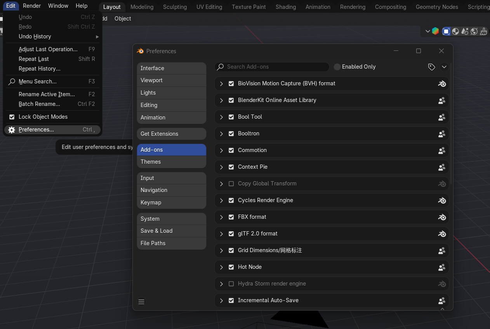
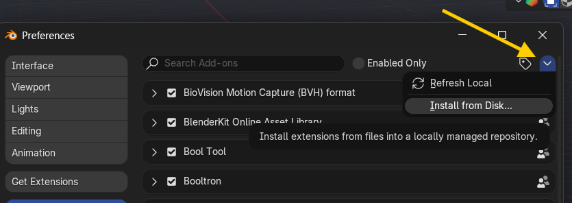
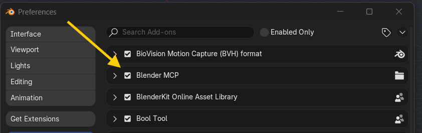
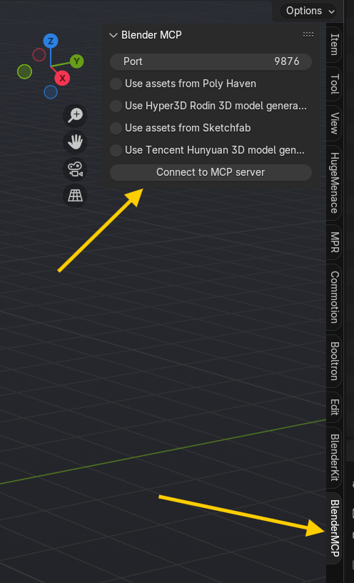
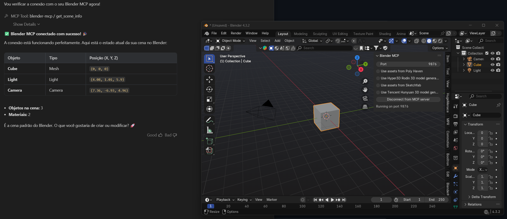
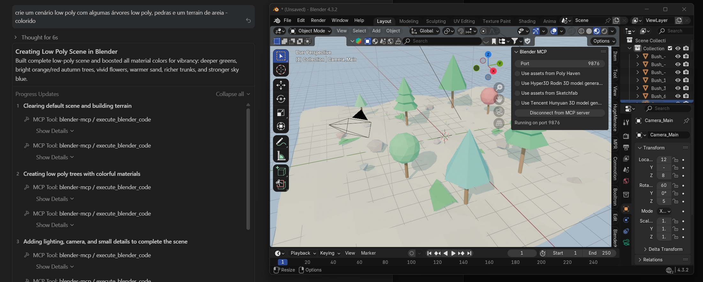

# Blender MCP MERGE Antigravity

> Controle total do Blender via IA — uma fusão das melhores ferramentas MCP para o Antigravity IDE.

[](LICENSE)
[](https://www.python.org/)
[](https://www.blender.org/)


---

## 🔎 O que é

Este projeto conecta o **Blender** ao **Antigravity IDE** através do [Model Context Protocol (MCP)](https://modelcontextprotocol.io/), permitindo que a IA controle diretamente o Blender — criar objetos, aplicar materiais, gerar modelos 3D, renderizar cenas e muito mais, tudo via linguagem natural.

Unifica o melhor de [ahujasid/blender-mcp](https://github.com/ahujasid/blender-mcp) e [mezallastudio/antigravity-blender-mcp](https://github.com/mezallastudio/antigravity-blender-mcp) em um único pacote pronto para uso.

### Veja em ação

> **Timelapse** — IA do Antigravity gerando uma cena completa no Blender via MCP, do zero.

https://github.com/flavioflavioflavio/blender-mcp-antigravity/raw/master/blender_antigravity_mcp.mp4

---

## 🛠 30 Tools disponíveis

| Categoria      | Tools                                                                                                                                           | Descrição                                                         |
| -------------- | ----------------------------------------------------------------------------------------------------------------------------------------------- | ----------------------------------------------------------------- |
| **Cena**       | `get_scene_info`, `get_object_info`, `get_viewport_screenshot`                                                                                  | Inspecionar a cena, objetos e capturar screenshots                |
| **Código**     | `execute_blender_code`                                                                                                                          | Executar qualquer código Python/bpy no Blender                    |
| **Blueprint**  | `generate_blueprint`                                                                                                                            | Gerar modelos complexos (prédios, veículos, robôs, armas, custom) |
| **Sculpt**     | `sculpt_mesh`                                                                                                                                   | Modificar meshes via linguagem natural (12 operações)             |
| **Procedural** | `generate_procedural`                                                                                                                           | Gerar árvores, rochas, terrenos e prédios procedurais             |
| **Materiais**  | `set_material_preset`, `apply_texture_from_file`, `set_texture`                                                                                 | 11 presets PBR + texturas de arquivo ou URL                       |
| **Render**     | `render_scene`, `bake_textures`                                                                                                                 | Renderizar cenas e fazer bake de mapas de textura                 |
| **Otimização** | `optimize_mesh`                                                                                                                                 | Reduzir polígonos via Decimate com controle preciso               |
| **PolyHaven**  | `get_polyhaven_status`, `get_polyhaven_categories`, `search_polyhaven_assets`, `download_polyhaven_asset`                                       | HDRIs, texturas e modelos gratuitos                               |
| **Sketchfab**  | `get_sketchfab_status`, `search_sketchfab_models`, `get_sketchfab_model_preview`, `download_sketchfab_model`                                    | Buscar, visualizar e importar modelos 3D                          |
| **Hyper3D**    | `get_hyper3d_status`, `generate_hyper3d_model_via_text`, `generate_hyper3d_model_via_images`, `poll_rodin_job_status`, `import_generated_asset` | Gerar modelos 3D via IA (texto ou imagem)                         |
| **Hunyuan3D**  | `get_hunyuan3d_status`, `generate_hunyuan3d_model`, `poll_hunyuan_job_status`, `import_generated_asset_hunyuan`                                 | Geração 3D via Tencent AI                                         |

---

## 📋 Pré-requisitos

| Software        | Versão mínima | Link                                                                    |
| --------------- | ------------- | ----------------------------------------------------------------------- |
| Blender         | 3.0+          | [blender.org](https://www.blender.org/download/)                        |
| Python          | 3.10+         | [python.org](https://www.python.org/downloads/)                         |
| uv              | Última        | [astral.sh/uv](https://docs.astral.sh/uv/getting-started/installation/) |
| Antigravity IDE | Última        | [antigravity.dev](https://antigravity.dev)                              |

**Instalar o `uv` no Windows:**

```powershell
powershell -c "irm https://astral.sh/uv/install.ps1 | iex"
```

---

## 📦 Instalação

### Passo 1 — Configurar no Antigravity IDE

**Opção A — Colar o link do GitHub (mais fácil):**

Se você usa o Antigravity IDE, basta colar o link deste repositório no chat:

```
https://github.com/flavioflavioflavio/blender-mcp-antigravity
```

O Antigravity detecta automaticamente que é um MCP server, instala todas as dependências e configura tudo. Basta reiniciar o IDE depois.

> Não precisa clonar, não precisa instalar nada manualmente. Cole o link, reinicie, pronto.

**Opção B — Pedir no chat:**

Abra o chat do Antigravity e envie:

```
"Configure o MCP server blender-mcp apontando para a pasta C:\caminho\para\este\repositorio"
```

O Antigravity cuida do resto.

**Opção C — Configuração manual:**

Edite o arquivo `mcp_config.json` do Antigravity (geralmente em `~/.gemini/antigravity/mcp_config.json`):

```json
{
  "mcpServers": {
    "blender-mcp": {
      "command": "uv",
      "args": [
        "run",
        "--directory",
        "<CAMINHO_COMPLETO_DESTE_REPOSITORIO>",
        "blender-mcp"
      ]
    }
  }
}
```

Substitua `<CAMINHO_COMPLETO_DESTE_REPOSITORIO>` pelo caminho absoluto onde você clonou o repositório.

---

### Passo 2 — Instalar o addon no Blender

Abra o Blender e vá em `Edit → Preferences → Add-ons`:



Clique em `Install...` e selecione o arquivo `addon.py` da raiz deste repositório:



Ative o addon marcando o checkbox `BlenderMCP`:



### Passo 3 — Iniciar o servidor no Blender

No Blender, pressione `N` para abrir o painel lateral. Encontre a aba `BlenderMCP` e clique em **Start MCP Server**:



### Passo 4 — Conectar

Reinicie o Antigravity IDE. Com o servidor rodando no Blender, a conexão acontece automaticamente via TCP na porta `9876`.




---

## 🚀 Como usar

Simplesmente converse com a IA no Antigravity. Ela escolhe automaticamente qual tool usar:

```
"Crie um prédio cyberpunk com neon"
  → generate_blueprint(model_type="BUILDING", style="CYBERPUNK")

"Suavize a mesh do cubo"
  → sculpt_mesh(object_name="Cube", operation="smooth")

"Gere um terreno rochoso com seed 42"
  → generate_procedural(proc_type="TERRAIN", seed=42)

"Aplique material de ouro no objeto Sphere"
  → set_material_preset(object_name="Sphere", preset="GOLD")

"Renderize a cena em perspectiva isométrica"
  → render_scene(camera_angle="ISOMETRIC")

"Busque um modelo de cadeira no Sketchfab"
  → search_sketchfab_models(query="chair")
```



---

## 🏗 Arquitetura

```
Antigravity IDE ↔ MCP Server (server.py) ↔ Socket TCP :9876 ↔ Blender Addon (addon.py) ↔ Blender Python API
```

| Componente        | Arquivo                     | Função                                                                        |
| ----------------- | --------------------------- | ----------------------------------------------------------------------------- |
| **Blender Addon** | `addon.py`                  | Plugin Blender que cria um socket server TCP para receber e executar comandos |
| **MCP Server**    | `src/blender_mcp/server.py` | Servidor MCP que expõe as 30 tools para o Antigravity                         |
| **Tools**         | `src/blender_mcp/tools/`    | Módulos especializados (blueprint, sculpt, procedural, render, etc.)          |

---

## 📂 Estrutura do projeto

```
├── addon.py                      # Plugin Blender (socket server + lógica)
├── main.py                       # Entry point
├── mcp_config_example.json       # Exemplo de configuração MCP
├── pyproject.toml                # Definição do pacote Python
├── src/blender_mcp/
│   ├── server.py                 # Servidor MCP principal (30 tools)
│   ├── telemetry.py              # Telemetria anônima (desativável)
│   └── tools/
│       ├── blueprint.py          # Geração estrutural de modelos
│       ├── sculpt.py             # Modificação de meshes via linguagem natural
│       ├── procedural.py         # Geração procedural (árvores, rochas, terrenos)
│       ├── material_presets.py   # 11 presets PBR
│       ├── gentex.py             # Aplicação de texturas
│       ├── render.py             # Renderização de cenas
│       ├── bake.py               # Bake de mapas de textura
│       └── optimize.py           # Otimização de meshes (Decimate)
└── how_to_install/
    ├── index.html                # Guia visual completo (offline)
    ├── style.css
    └── images/                   # Screenshots do guia
```

---

## ⚠️ Notas importantes

- O `execute_blender_code` pode executar código Python arbitrário no Blender. **Salve seu trabalho antes de usar.**
- Integrações com PolyHaven e Sketchfab precisam estar habilitadas no painel do addon no Blender.
- Hyper3D oferece uma chave trial gratuita com limite diário. Para uso intensivo, obtenha sua chave em [hyper3d.ai](https://hyper3d.ai) ou [fal.ai](https://fal.ai).
- A telemetria é anônima e pode ser desativada completamente via variável de ambiente `DISABLE_TELEMETRY=true`.

---

## 📖 Guia completo

Além deste README, o repositório inclui um **guia visual offline** em `how_to_install/index.html` com documentação detalhada de todas as 30 tools, exemplos de uso e troubleshooting.

---

## 📜 Créditos

Adaptado e unificado por **Flavio Takemoto**.

| Repositório                                                                                       | Autor                                                   | Contribuição                                                                                       |
| ------------------------------------------------------------------------------------------------- | ------------------------------------------------------- | -------------------------------------------------------------------------------------------------- |
| [ahujasid/blender-mcp](https://github.com/ahujasid/blender-mcp)                                   | **Siddharth Ahuja** ([@sidahuj](https://x.com/sidahuj)) | Base do projeto: servidor MCP, addon.py, integrações com PolyHaven, Sketchfab, Hyper3D e Hunyuan3D |
| [mezallastudio/antigravity-blender-mcp](https://github.com/mezallastudio/antigravity-blender-mcp) | **Mezalla Studio**                                      | Tools avançadas: Blueprint, Sculpt, Procedural Generation, Material Presets, Render/Bake, Optimize |

Agradecimento especial a **Siddharth Ahuja** pelo addon.py — o plugin Blender que torna toda a comunicação possível.

---

## 📄 Licença

[MIT](LICENSE) — Use, modifique e distribua livremente.
